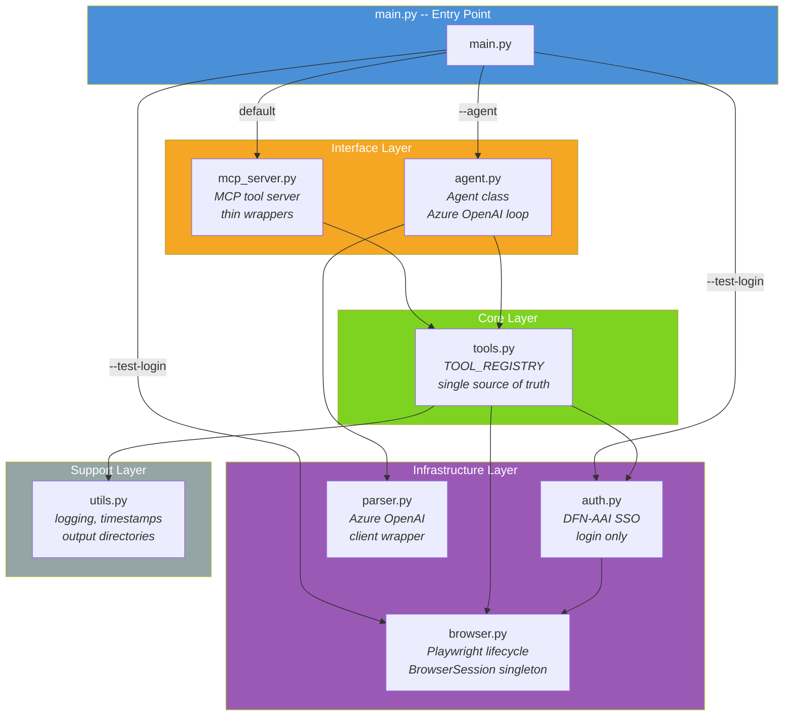
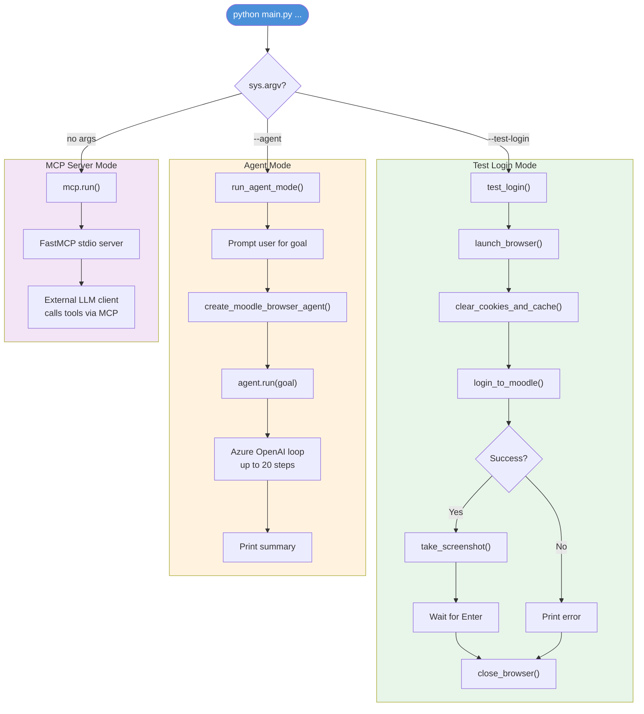
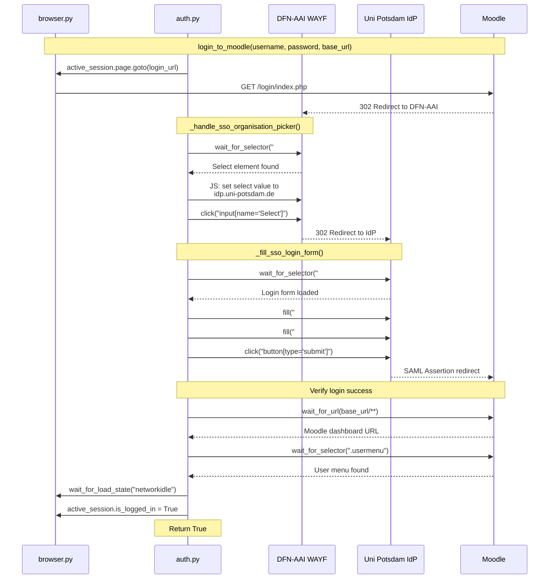
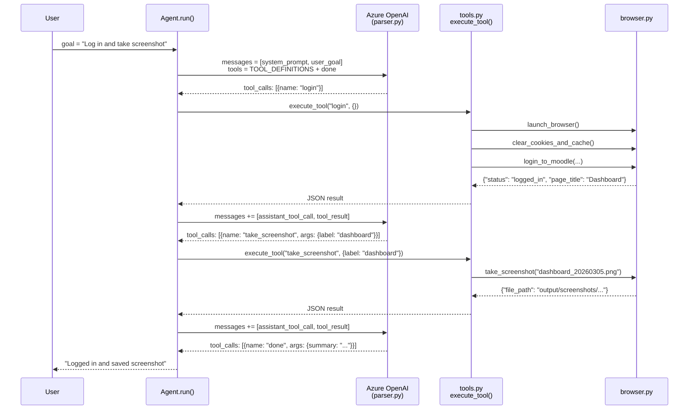
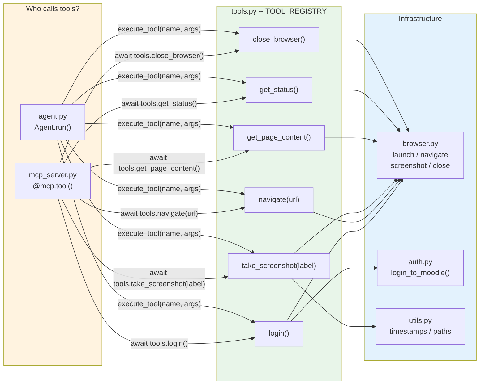

# Architecture Diagrams

Visual overview of everything implemented so far.

---

## 1. Module Architecture

Layered dependency structure: entry point, interface layer (MCP + Agent),
shared tools, infrastructure (browser, auth, parser), and support utilities.

---

## 2. Run Modes

Three ways to start the app: MCP server (default), standalone agent, manual login test.

---

## 3. DFN-AAI SSO Login Flow

Full Shibboleth login sequence: Moodle redirects to WAYF, JavaScript selects
University of Potsdam, IdP login form is filled, SAML assertion redirects back.

---

## 4. Agent Loop (Azure OpenAI Tool-Calling)

The Agent sends messages + tool definitions to GPT-4o, receives tool calls,
dispatches them through tools.py, feeds results back, and repeats until done.

---

## 5. Tool Dispatch -- Single Source of Truth

Both MCP server and Agent converge on the same tools.py implementations.
Each tool maps down to browser.py, auth.py, or utils.py.

